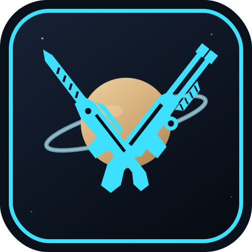
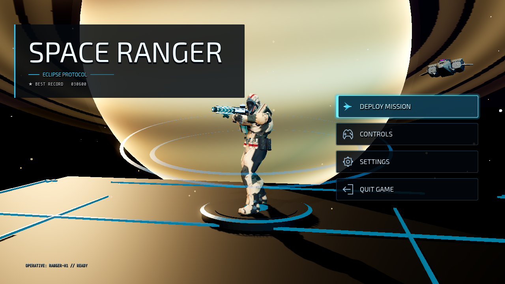
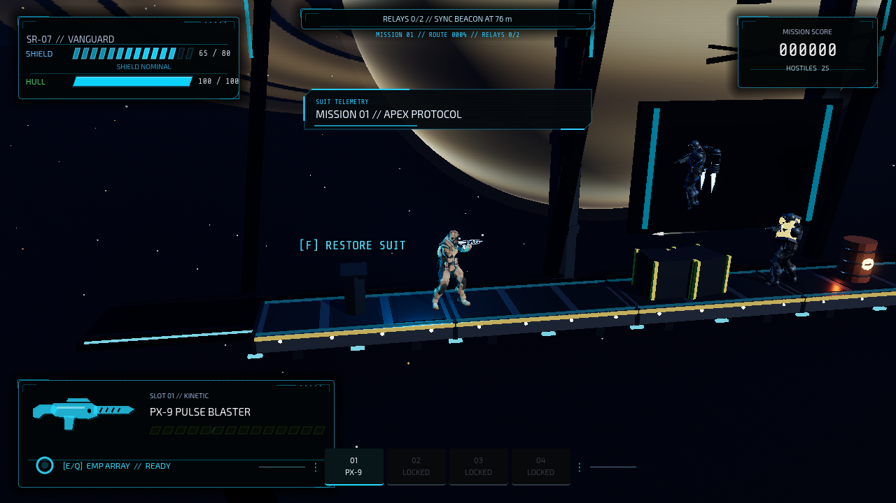
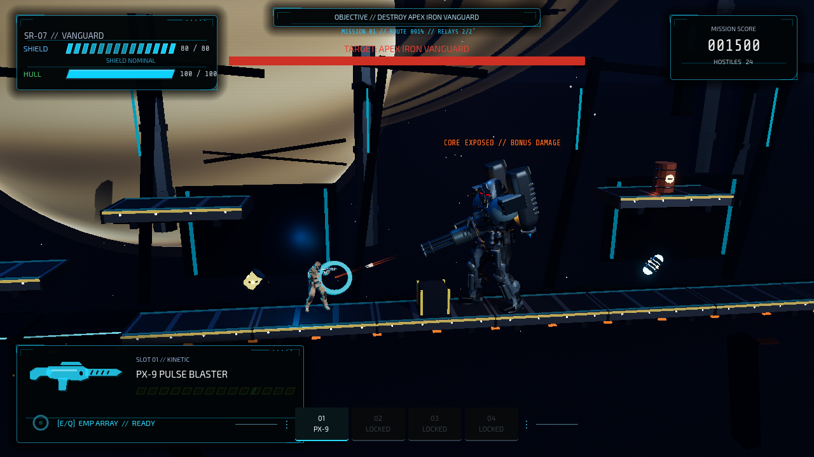

# Space Ranger: Eclipse Protocol

A 2.5D side-scrolling space shooter built in **Godot 4.7 Forward+**. Drop onto a ring-station in orbit of a gas giant, unlock weapons as you fight, and take down three campaign bosses.

<p align="center">
  
</p>

<p align="center">
  <a href="https://github.com/ClaudiuJitea/space-ranger/releases/latest"></a>
  
  
</p>







## Play

Grab the latest build from **[Releases](https://github.com/ClaudiuJitea/space-ranger/releases/latest)**.

| Platform | Package |
| --- | --- |
| Linux x86_64 | `SpaceRanger-linux-x86_64.tar.gz` |
| Windows x86_64 | `SpaceRanger-windows-x86_64.zip` |

**Linux**

```bash
tar -xzf SpaceRanger-linux-x86_64.tar.gz
chmod +x SpaceRanger.x86_64
./SpaceRanger.x86_64
```

**Windows** — unzip and run `SpaceRanger.exe`.

From source (Godot 4.7.2 or later):

```bash
godot --path .
```

## Campaign

Three linked missions. You start with the **PX-9 Pulse Blaster**. Scattergun, railgun and launcher are pickups — they stay locked until you find them.

| Mission | Length | Boss |
| --- | --- | --- |
| Apex Protocol | 256 m | Apex Iron Vanguard |
| Nightglass Reactor | 288 m | RIFT Alpha Matriarch |
| Emberfall Citadel | 328 m | Emberfall Seraph |

Sync relays with **F** to open each arena. Cyan suit anchors restore hull and shield and save a checkpoint for the current run.

## Combat

- 360° mouse aim, double jump, dash with i-frames
- Regenerating energy shield over hull
- Heat-managed arsenal — overheat and you wait
- EMP grenade for clustered fire
- Three-phase bosses with telegraphed attacks and a bonus-damage core window

**Weapons**

| Slot | Weapon | Role |
| --- | --- | --- |
| 1 | PX-9 Pulse Blaster | Rapid plasma, always available |
| 2 | TITAN-8 Scattergun | Close-range pellet fan |
| 3 | LR-77 Photon Railgun | Piercing beam |
| 4 | HV-4 Havoc Launcher | Homing rockets, splash, rocket-jump |

## Controls

| Action | Input |
| --- | --- |
| Move | `A` / `D` or arrows |
| Jump / double jump | `Space`, `W` or `↑` |
| Dash | `Shift` or right mouse |
| Aim | Mouse |
| Fire | Left mouse or `J` |
| Weapons | `1` `2` `3` `4` or mouse wheel |
| EMP | `E` or `Q` |
| Interact / sync relay | `F` |
| Pause | `Esc` or `P` |

## Project

```
space-ranger/
├── assets/models/     # GLB characters, weapons, bosses
├── src/
│   ├── autoload/      # Game, audio, FX
│   ├── entities/      # Player, enemies, pickups
│   ├── environment/   # Platforms, hazards, backdrop
│   ├── levels/        # Three campaign missions
│   ├── projectiles/
│   └── ui/            # Main menu, HUD, pause
├── docs/screenshots/
└── project.godot
```

Export presets live in `export_presets.cfg` (Linux + Windows, x86_64, embedded PCK). Blender work files are not packed into the game builds.

Made with [Godot 4.7](https://godotengine.org/).
