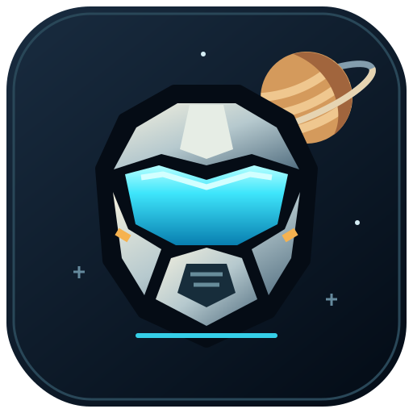
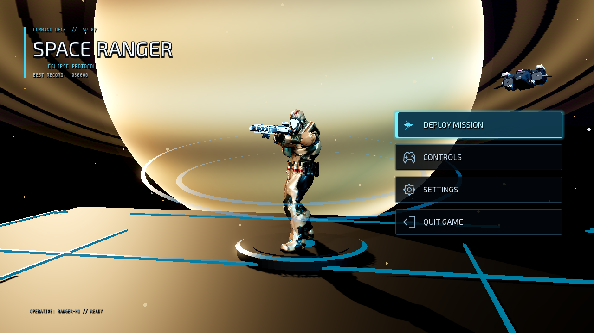
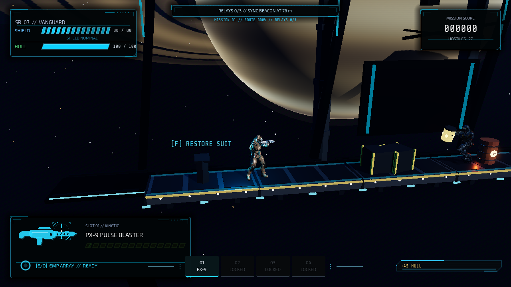
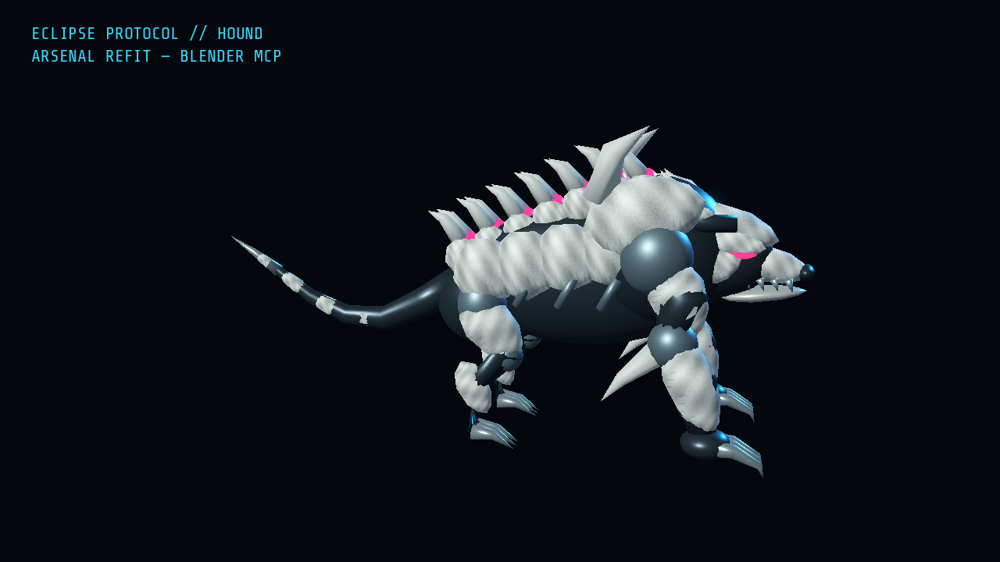
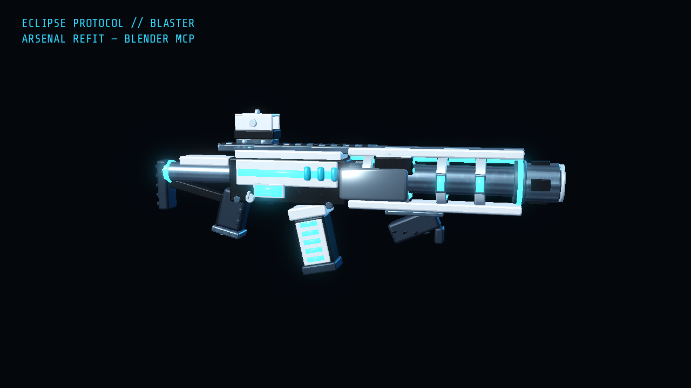
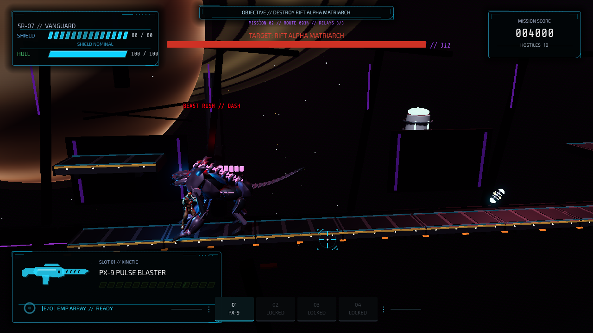

# Space Ranger: Eclipse Protocol — 1.5

A 2.5D side-scrolling space shooter built in **Godot 4.7 Forward+**. Drop onto a ring-station in orbit of a gas giant, unlock weapons as you fight, and take down five campaign bosses.

<p align="center">
  
</p>

<p align="center">
  <a href="https://github.com/ClaudiuJitea/space-ranger/releases/latest"></a>
  
  
</p>





<p align="center">
  
  
</p>



## New in 1.5

- Five campaign missions with distinct bosses, extra salvage decks and sector scenery.
- Refitted enemies and weapons, armed hounds and Wasp drones, and a corrected ranger menu pose.
- Biomechanical Rift hound with worn ivory armor, crimson spine cores, hooked claws and a segmented tail.
- Compact pickup readout: consecutive repairs combine into one total without covering combat.
- 30 recorded MP3 effects, three music tracks, and weapon-specific sound cues.
- New ranger helmet app icon with a ringed planet for Windows and Linux.

## Play

Download **[version 1.5](https://github.com/ClaudiuJitea/space-ranger/releases/tag/v1.5)** for Windows or Linux. Local builds are also generated in `dist/v1.5/`.

| Platform | Package |
| --- | --- |
| Linux x86_64 | `SpaceRanger-1.5-linux-x86_64.tar.gz` |
| Windows x86_64 | `SpaceRanger-1.5-windows-x86_64.zip` |

**Linux**

```bash
tar -xzf SpaceRanger-1.5-linux-x86_64.tar.gz
cd SpaceRanger-1.5-linux-x86_64
./SpaceRanger.x86_64
```

**Windows** — unzip `SpaceRanger-1.5-windows-x86_64.zip`, open the extracted folder, and run `SpaceRanger.exe`.

Both builds target x86_64 and include the game data inside the executable. They require a GPU compatible with Godot Forward+: Vulkan on Linux, Direct3D 12 on Windows. `SHA256SUMS.txt` records the package checksums.

From source (Godot 4.7.2 or later):

```bash
godot --path .
```

## Campaign

Five linked missions. You start with the **PX-9 Pulse Blaster**. Scattergun, railgun and launcher are pickups — they stay locked until you find them.

| Mission | Length | Boss |
| --- | --- | --- |
| Apex Protocol | 288 m | Apex Iron Vanguard |
| Nightglass Reactor | 320 m | RIFT Alpha Matriarch |
| Emberfall Citadel | 360 m | Emberfall Seraph |
| Frostworks Shipyard | 368 m | Cryo Leviathan |
| Eclipse Sanctuary | 400 m | Eclipse Sovereign |

Sync relays with **F** to open each arena. Cyan suit anchors restore hull and shield and save a checkpoint for the current run.

## Combat

- 360° mouse aim, double jump, dash with i-frames
- Regenerating energy shield over hull
- Heat-managed arsenal — overheat and you wait
- EMP grenade for clustered fire
- Three-phase bosses with telegraphed attacks and a bonus-damage core window

**Weapons**

| Slot | Weapon | Role |
| --- | --- | --- |
| 1 | PX-9 Pulse Blaster | Rapid plasma, always available |
| 2 | TITAN-8 Scattergun | Close-range pellet fan |
| 3 | LR-77 Photon Railgun | Piercing beam |
| 4 | HV-4 Havoc Launcher | Homing rockets, splash, rocket-jump |

## Controls

| Action | Input |
| --- | --- |
| Move | `A` / `D` or arrows |
| Jump / double jump | `Space`, `W` or `↑` |
| Dash | `Shift` or right mouse |
| Aim | Mouse |
| Fire | Left mouse or `J` |
| Weapons | `1` `2` `3` `4` or mouse wheel |
| EMP | `E` or `Q` |
| Interact / sync relay | `F` |
| Pause | `Esc` or `P` |

## Project

```
space-ranger/
├── assets/models/     # GLB characters, weapons, bosses
├── src/
│   ├── autoload/      # Game, audio, FX
│   ├── entities/      # Player, enemies, pickups
│   ├── environment/   # Platforms, hazards, backdrop
│   ├── levels/        # Five campaign missions
│   ├── projectiles/
│   └── ui/            # Main menu, HUD, pause
├── docs/screenshots/
└── project.godot
```

Weapons, UI, movement, and combat use downloaded MP3 sound effects in `assets/audio/sfx/`, with looping music beds in `assets/audio/music/`.

Export presets live in `export_presets.cfg` (Linux + Windows, x86_64, embedded PCK). Blender work files are not packed into the game builds.

Made with [Godot 4.7](https://godotengine.org/).

## Eclipse expansion art

The five missions feature Blender-authored sector landmarks, optional lift-access salvage decks, and additional arena supplies. Cerberus K-9 hounds carry charged rail weapons and telegraph their melee lunges; Wasp interceptors strafe and warn before twin pulse bursts. The new Cryo Leviathan uses floor-skimming cryo lances and drone escorts; Eclipse Sovereign uses radial volleys, crossfire and hound guards. All bosses retain three phases and exposed-core damage windows.

The ranger's fitted suit armor and cyan optics retain the original skeleton and weapon IK. Each original boss has an individual material and armor pass. Original assets remain available; the ranger and sector scenery use `assets/models/eclipse_expansion/`, while enemy and weapon scenes use `assets/models/arsenal_refit/`. The Blender source gallery is `eclipse_atelier.blend`, authored through the installed Blender MCP bridge using `tools/build_eclipse_expansion.py`.


Asset previews: [Ranger](docs/screenshots/eclipse/ranger.png), [Rift hound](docs/screenshots/arsenal/hound.png), [Wasp](docs/screenshots/eclipse/wasp.png), [Cryo Leviathan](docs/screenshots/eclipse/leviathan.png), [Eclipse Sovereign](docs/screenshots/eclipse/sovereign.png).

Validation tools (run with `godot --headless --path . --fixed-fps 60 tools/<name>.tscn`): `verify_campaign`, `verify_campaign_routes`, `verify_eclipse_expansion`, `verify_vanguard_boss`, and `verify_colossus_boss`. Run `godot --path . tools/eclipse_gallery.tscn` to regenerate the asset render gallery.


## Enemy and arsenal refit

All seven enemy types and five bosses now use `assets/models/arsenal_refit/`, together with the scout jetpack/exhaust, four player guns, and enemy rifle. Armor retains its fitted silhouette; the refit adds baked texture color, gunmetal mechanisms, faction optics, fine heat-sink ribs, receiver panels, and weapon-specific charge indicators. Enforcers use red optics; airborne scouts and Wasps use cyan; turrets use amber; gunships use violet. Grips, muzzles, skeletons, locomotion clips, and articulated pivots remain compatible with the existing combat controllers.

`manifest.json` maps all 19 exports to their source models. `arsenal_atelier.blend` contains the Blender source gallery. Run `tools/run_arsenal_refit.py --port 9876 --prompt "your art request"` using the Python environment with the installed MCP package to rebuild through Blender MCP.

Audio uses the 30 downloaded MP3 effects and three downloaded music tracks already in `assets/audio/`. Combat cue aliases reuse these recordings: pulse for PX-9/scouts, spread for TITAN/turrets/Apex cannons, beam for LR-77/hounds/cryo attacks, plasma bursts for Wasps/void attacks/EMP, and rocket launch for HV-4. Music retains its current menu or mission mood when its deferred initialization finishes. Synthesized audio is only a fallback if an asset is missing.

Run `godot --headless --path . --fixed-fps 60 tools/verify_arsenal_refit.tscn` to check downloaded audio, gun firing/aiming, and enemy animation bindings. Run `godot --path . tools/arsenal_gallery.tscn` to render all refitted models into `docs/screenshots/arsenal/`.

Pickup notifications use one compact bottom-right readout; repeated repairs and shield pickups aggregate and expire quickly. The armed hound has a reference-inspired ivory biomechanical shell, crimson dorsal cores, hooked foreclaws and a segmented tail. Its dedicated Blender source is `assets/models/arsenal_refit/rift_hound_atelier.blend`, regenerated with `tools/build_rift_hound.py` through Blender MCP.

## Build version 1.5

Install Godot **4.7.2** and the matching export templates, then run:

```bash
python tools/make_app_icon.py
python tools/build_release.py
```

The icon generator requires `cairosvg` and `Pillow`. The release script exports both platforms, bundles the icon and quick-start notes, and writes versioned archives plus `SHA256SUMS.txt` under `dist/v1.5/`. The SVG icon source stays editable in `icon.svg`; generated PNG and multi-resolution ICO files are used by Godot and Windows.
